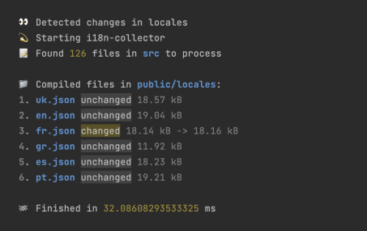

# 🈯️️ i18n-collector

A tool that makes it easy to manage many translation files in your application.



## Installation

```bash
npm install i18n-collector --save-dev
```

## Documentation

- [The Problem](#the-problem)
- [Usage with React and i18next](#usage-with-react-and-i18next)
- [Requirements](#requirements)
- [CLI](#cli)
- [JavaScript API](#javascript-api)

## The Problem

Imagine you have a large web application,
and you have to support many languages in it. How do you manage translations?

There are many problems you can face with:

- ❌ You have large translation files with many keys from different domain areas that are hard to manage.
- ❌ You have to control that each translation key is unique manually.
- ❌ You have to import many translation files into your app manually.
- ❌ **You have to keep track of too much information about your translations.**

This tool allows you to split your translations into any number of files and collect them into one file per language in the automatic mode.

With this tool, you can:

- ✅ Split your translations into any number of files.
- ✅ One component / feature - one translation file.
- ✅ Get only one file per language with all translations in the automatic mode.
- ✅ Use the **watch mode** during development to automatically compile translation files whenever changes are made.

> ⚠️ This tool is designed to help you manage many translation files and merge them into one file per language. It is recommended that you use an i18n library or framework to make use of these merged files.

We recommend using [i18next](https://www.i18next.com), which has excellent support for TypeScript. When used together with i18n-collector, it will be a perfect match.

## Usage with React and i18next

This is a simple example of how to use this tool with `i18next` in React.

Note that you can also use any other i18n library or framework of your choice.

Let's start by installing all the necessary dependencies.

```bash
npm i i18next react-i18next
npm i i18n-collector --save-dev
```

Let's take a closer look at each of these dependencies.

- [i18next](https://www.i18next.com) is a core library for i18n.
- [react-i18next](https://react.i18next.com) is a library for using `i18next` with React.
- `i18n-collector` is a tool that simplifies the management of multiple translation files in your application.

### 1. Configure i18next

Let's assume that our app needs to support two languages: `🇬🇧English` and `🇺🇦Ukrainian`.

`/src/i18n.js`

```js
import i18n from "i18next";
import uk from "./locales/uk.json";
import en from "./locales/en.json";

i18n.use(initReactI18next).init({
  resources: {
    en,
    uk,
  },
  lng: "en",
  fallbackLng: "en",
  interpolation: {
    escapeValue: false,
  },
});
```

We've created a configuration file for i18next and imported `./locales/en.json` and `./locales/uk.json` files.
These files will be generated by i18n-collector later, and it is important that you **do not create them manually**.

> ❕ The configuration we've provided for i18next is a simple one that may not meet all of your needs. You may need to configure i18next differently depending on your specific requirements. For more information about i18next configuration options, please refer to [the official i18next documentation](https://www.i18next.com/overview/configuration-options).

### 2. Add new scripts to package.json

```json
{
  "scripts": {
    "i18n:compile": "npx i18n-collector run locales --input src --clear",
    "i18n:watch": "npx i18n-collector run locales --input src --clear --watch"
  }
}
```

Let's take a closer look at each of these scripts.

- `i18n:compile` - compiles translation files into the `./locales` directory
- `i18n:watch` - compiles translation files and watches for changes (**useful for development**).

### 3. Add `./locales` to your `.gitignore` file.

If you are working with a team, it is recommended that you do not commit your compiled translation files to the repository, as they can lead to merge conflicts.

`.gitignore`

```
# other files
locales
```

### 4. Create a new component

Let's say we need to create a `Product` component to display a product card. To get started, let's create a directory for our component and add a file for its translations

```
src
└── components
    └── Product
        ├── Product.jsx
        └── Product.locale.json

```

As you can see, we've created a `Product.locale.json` file next to our `Product.jsx` file.
This file will contain translations for our `Product` component.

Now, let's prepare some translations for our Product component.

`/src/components/Product/Product.locale.json`

```json
{
  "en": {
    "name": "Product name",
    "description": "Description",
    "price": "Price",
    "buy": "Add to cart"
  },
  "uk": {
    "name": "Назва товару",
    "description": "Опис",
    "price": "Ціна",
    "buy": "Додати в кошик"
  }
}
```

Let's write our component.

`/src/components/Product/Product.jsx`

```jsx
import { useTranslation } from "react-i18next";

export default function Product({ product }) {
  const { t } = useTranslation();

  return (
    <div>
      <h1>
        {t("Product:name")}: {product.name}
      </h1>
      
      <p>
        {t("Product:description")}: {product.description}
      </p>
      <p>
        {t("Product:price")}: {product.price}
      </p>
      <button>{t("Product:buy")}</button>
    </div>
  );
}
```

As you can see, we've used the `useTranslation` hook with our `Product` namespace to access the translations for our component.

> ⚠️ Note that you shouldn't import the `Product.locale.json` file anywhere. It'll be found and handled automatically by i18n-collector.

### 5. Compile translations files

We've created a component and added translations for it.
Now we can use the `i18n:compile` script to compile our translations files.

```bash
npm run i18n:compile
```

As a result, we now have two files in the `./locales` directory that were generated by the above script.

```
locales
├── en.json
└── uk.json
```

Let's take a look at the `en.json` file.

`/locales/en.json`

```json
{
  "Product": {
    "name": "Product name",
    "description": "Description",
    "price": "Price",
    "buy": "Add to cart"
  }
}
```

Note that it is important to use the correct locale keys when using the `useTranslation` hook in the React components, as they will match the keys defined in the translation files.

For example, if we have a key `description` defined in the `Product.locale.json` file, we will need to use the same key in the component when calling the `t` function, like `t('Product:productTitle')`.
The `Product:` prefix (namespace) is added automatically by `i18n-collector` based on the name of the file.

> 👀 You can use the `--watch` flag to automatically recompile your translation files when you make changes to them.

### 6. ⚡️ Add TypeScript

You can essentially improve your development experience by using TypeScript with `i18next` and `i18n-collector`.

`i18n-collector` will collect all your translations and generate a single file for each language
and `i18next` can use these files to infer types for all your translations.

Let's use official `i18next` [TypeScript example](https://www.i18next.com/overview/typescript) as a base.

`i18n.ts`

```ts
import "i18next";
import en from "./locales/en.json"; // import compiled file

// extend i18next's module declaration
declare module "i18next" {
  interface CustomTypeOptions {
    resources: {
      [key in keyof typeof en]: (typeof en)[key];
    };
  }
}

// configure i18next
```

Now TypeScript will check your usage of `t` function and will show you an error if you use a wrong namespace or key.

```tsx
<button>{t("Product:buy")}</button> // ✅ correct
```

```tsx
<button>{t("WrongNamespace:buy")}</button> // ❌ incorrect
```

## Requirements

There are several requirements for your project to use `i18n-collector`.

### 1. Use `[namespace].locale.json` extension for translation files

Each translation file should have a `[namespace].locale.json` extension where `[namespace]` is a namespace for your translations.

> You can override this behavior by using JavaScript API.

### 2. Use a separate file for each namespace

You will get an error if you have the same namespace in different files. It ensures a better development experience.

> You can override this behavior by using `--merge` option or JavaScript API.

### 3. Import only compiled files

Do not import `[namespace].locale.json` files directly.
Import only compiled files.

## CLI

You can use our CLI to compile translation files.

There is only one available command: `compile [options] <output>`.

It requires one argument:

- `output`: the directory where the translation files will be generated.

Additionally, there are several options:

- `input <value>`: the input directory where the tool will search for translation files. The default value is the current working directory.
- `clear`: clears the output directory before compiling the translation files. The default value is `false`.
- `watch`: watches for changes in the input directory and recompiles the translation files. Only use this option during development. The default value is `false`.
- `recursive`: searches for translation files recursively. The default value is `true`.
- `merge`: allows having the same namespace in different files. This is not recommended. The default value is `false`.
- `help`: displays the help for the command.

For example:

```bash
npx i18n-collector run locales --input src --clear --watch
```

The above command will compile translation files into the `./locales` directory and watch for changes to `*.locale.json` files in the `./src` directory.
The `./locales` directory will be cleared before compiling translation files.

## JavaScript API

Our JavaScript API allows you to create a custom pipeline for compiling your translation files.
This feature is particularly useful if you require multiple pipelines or have specific requirements.

### scan (options: ScanOptions): Promise\<LocaleFile[]\>

**Scan the specified directory for localization files.**

The function takes the `ScanOptions` object as an argument, which includes the following properties:

- `path` - The path to the directory to scan
- `matcher` - A [Matcher](#matcher-type) function for filtering the files to be scanned.
- `recursive` [optional] - A boolean value indicating whether to scan subdirectories recursively. The default value is `true`.

The function returns a promise that resolves to an array of [LocaleFile](#localefile-type) objects

### compile(options: CompileOptions): Promise\<CompiledLocales\>

**Compiles the specified locales.**

The function takes the `CompileOptions` object as an argument, which includes the following properties:

- `files` - The array of [LocaleFile](#localefile-type) objects to be compiled.
- `parser` [optional] - A [Parser](#parser-type) object for parsing the files.
- `merge` [optional] - A boolean value indicating whether to merge namespaces from different files. The default value is `false`.

Returns a promise that resolves to the [CompiledLocales](#compiledlocales-type) object.

### emit(options: EmitOptions): Promise\<Stats[]\>

**Writes the compiled locales to the file system.**

The function takes the `EmitOptions` object as an argument, which includes the following properties:

- `locales` - A [CompiledLocales](#compiledlocales-type) object.
- `outputPath` - The path to the directory where the files will be written.
- `clear` [optional] - A boolean value indicating whether to clear the output directory before writing files. The default value is `false`.

The function returns a promise that resolves to an array of [Stats](#stats-type) objects.

### run(options: RunnerOptions): Promise\<Stats[]\>

**Runs the entire pipeline, including scanning the directory for localization files, compiling the locales, and emitting the results to the file system.**

Receive the options `RunnerOptions` object with the following properties:

- `outputPath` - The path to the directory where the files will be written.
- `inputPath` [optional] - The path to the directory to scan.
- `matcher` [optional] - The [Matcher](#matcher-type) to use for filtering files. This can be a `RegExp` or a `function` that receives a file path and returns a boolean. The default value is `/.+\.locale\.json/`.
- `merge` [optional] - A boolean value indicating whether to merge namespaces from different files. The default value is `false`.
- `clear` [optional] - A boolean value indicating whether to clear the output directory before writing files. The default value is `false`.
- `recursive` [optional] - A boolean value indicating whether to scan subdirectories recursively. The default value is `true`.
- `parser` [optional] - The [Parser](#parser-type) object to use for parsing the files.

The function returns a promise that resolves to an array of [Stats](#stats-type) objects

### watch(options: RunnerOptions): Promise\<Stats[]\>

This function is similar to run, but it also watches for changes in the input directory and automatically recompiles the translation files. It uses the same `RunnerOptions` object as the run function.

> Note that you can use the `--watch` flag when running the command-line interface to achieve the same result.

### Types

#### Parser (Type)

```ts
MayAsync<(options: { filePath: string; fileContent: Buffer }) => ParseResult>;
```

#### ParseResult (Type)

```ts
{
  id: unknown;
  translations: Record<string, unknown>;
  namespace: string;
}
```

#### Matcher (Type)

```ts
RegExp | MayAsync<(filePath: string) => boolean>;
```

#### LocaleFile (Type)

```ts
{
  filePath: string;
  content: Buffer;
  bytes: number;
}
```

#### CompiledLocales (Type)

```ts
Record<string, Record<string, unknown>>;
```

#### Stats (Type)

```ts
{
  filePath: string;
  isNew: boolean;
  isChanged: boolean;
  isDeleted: boolean;
  localeNewFile: LocaleFile | null;
  localeFileBefore: LocaleFile | null;
}
```

## License

[MIT](LICENSE)
